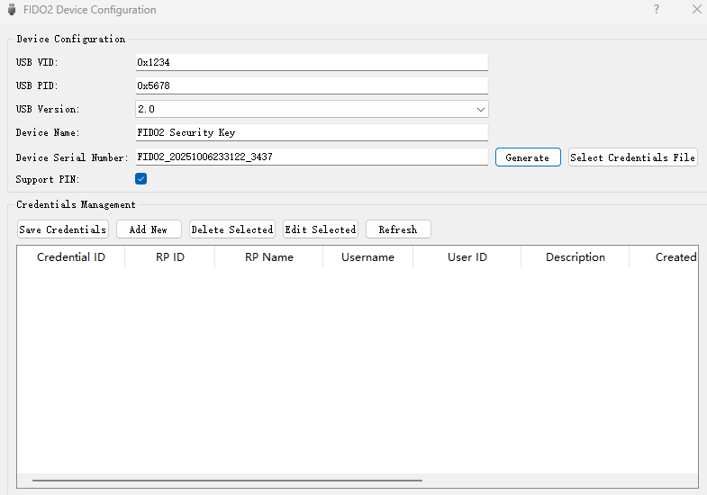

# ⚠️ The driver is not signed, please disable driver signature enforcement first, then install it.

# VirtualFido2-USB

[English](README.md) | [中文](README.zh-CN.md)

## Overview

VirtualFido2-USB is a virtual FIDO2 security key implementation that provides WebAuthn authentication capabilities. This project implements the FIDO2 specification to create a software-based authenticator that can be used for passwordless authentication.

## FIDO2 Device Workflow

The following diagram illustrates the complete FIDO2 device authentication workflow with all 18 detailed steps:

### Complete Workflow Steps (18 Steps)

#### Phase 1: Device Initialization
1. **Device initialization**: Create CA public key, private key, and certificate
2. **Credential key creation**: Create credential public key, private key and credential certificate based on CA certificate
3. **PIN communication setup**: Create PIN communication public/private key pair

#### Phase 2: Credential Registration
4. **Client request**: Client requests MakeCredential
5. **PIN support check**: Device checks if PIN is supported, if yes then checks if PIN is already set
6. **PIN setup required**: If PIN is not set, return error code, telling client PIN setup is required
7. **Key agreement**: Client sends getKeyAgreement to get key exchange information, calculate shared key
8. **PIN encryption**: Client encrypts user input password with shared key, sends encrypted password and public key info to device
9. **PIN decryption**: Device receives setPIN request, uses client's public key to generate shared key, decrypts encrypted PIN with shared key, then records PIN hash value
10. **PIN token generation**: Client sends getPINToken request, device decrypts encrypted pinHash with shared key, compares with locally stored pinHash, if match returns shared key encrypted pinToken
11. **PIN setup complete**: Device has completed PIN setup and pinToken acquisition, if device doesn't support PIN, steps 6-10 are skipped
12. **PIN validation**: Continue from step 5, if device supports PIN and PIN is set, validate pinToken per client request, if validation fails return PIN error
13. **User authentication**: Device doesn't support PIN, or pinToken validation succeeds, device starts creating credential, before creating credential device shows authentication UI for user consent
14. **Credential creation**: After user allows, device creates credential info and sends to client, then stores locally. Credential info includes certificate, public key, and randomly generated credential ID

#### Phase 3: Authentication
15. **Authentication request**: Client requests GetAssertion authentication, device looks up credential info by credential ID passed from client
16. **Credential not found**: If not found, return credential not found error
17. **Credential validation**: If found, validate token, rp info, then send clientDataHash, rp info from client and locally stored credential info to client, and sign this data
18. **Authentication complete**: Client receives Assertion data from device, verifies with device's public key, then compares received credential info for authentication

## Key Features

- **WebAuthn Compliance**: Full implementation of WebAuthn specification
- **PIN Support**: Optional PIN-based user verification with secure key exchange
- **Secure Key Management**: Proper key generation and storage
- **Certificate-based Authentication**: CA-signed credentials for enhanced security
- **Cross-platform**: Works on multiple operating systems
- **Complete Workflow**: Implements all 18 steps of the FIDO2 authentication process

## Security Considerations

- All cryptographic operations use industry-standard algorithms
- PIN transmission is encrypted using shared key agreement
- Credentials are stored securely with proper access controls
- Certificate-based authentication provides additional security layer
- PIN setup and validation follow secure protocols

## License

This project is licensed under the MIT License - see the [LICENSE](LICENSE) file for details.

## Contributing

Contributions are welcome! Please feel free to submit a Pull Request.

## Support

For support and questions, please open an issue on GitHub.
